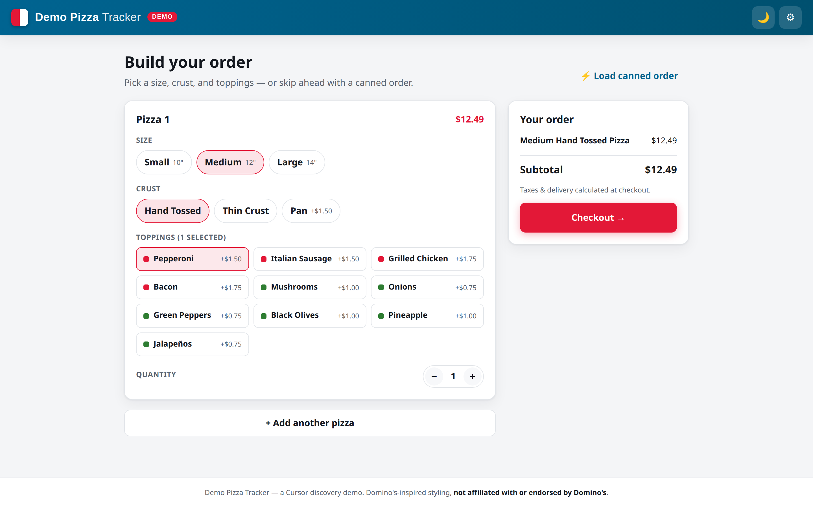
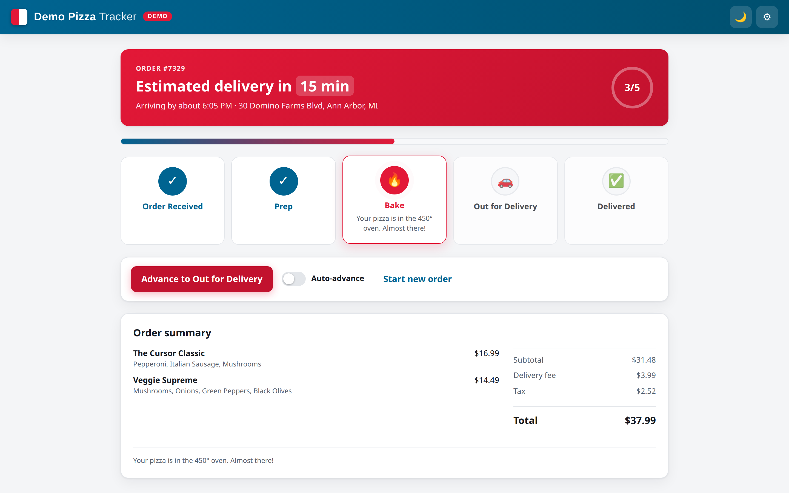

# Demo Pizza Tracker

A small, polished **Domino's-inspired** pizza ordering + order-tracking demo built for a
Cursor discovery meeting. It's a pocket demo — place an order (or load a canned one) and
watch it move through a live tracker: **Received → Prep → Bake → Out for delivery → Delivered**.

> ⚠️ **Demo only.** Domino's-inspired styling (red/blue, clean, modern) but clearly labeled
> **DEMO**. Not affiliated with, or endorsed by, Domino's. No real payments, auth, maps, or
> backend — everything runs in the browser with mock data.




## Stack

Boring and reliable on purpose:

- **Vite + React + TypeScript** — one dev server, one build, no framework surprises
- **Plain CSS** (no UI kit) — Domino's-inspired theme, dark mode, responsive
- **No external APIs, keys, or backend** — state lives in React + `localStorage`

## Run it

Requires Node 18+ (built and tested on Node 22).

```bash
npm install
npm run dev
```

Then open the printed URL (default http://localhost:5173).

Other scripts:

```bash
npm run build      # typecheck + production build
npm run preview    # serve the production build
npm run typecheck  # types only
```

## 3-minute demo script (exact clicks)

Fresh clone → order → tracker in under two minutes.

1. **Open the app** (`npm run dev`, open the URL). You land on **Build your order**.
   Point out the Domino's-inspired look and the **DEMO** badge in the header.
2. **Build a pizza** (~30s): pick a **Size** (e.g. Large), a **Crust**, and toggle a few
   **Toppings**. The right-hand **Your order** summary and price update live.
   - _Shortcut if you're tight on time:_ click **⚡ Load canned order** in the top-right to
     jump straight to the tracker with a 2-pizza order, and skip to step 5.
3. Click **Checkout →**.
4. On **Checkout**, note the prefilled name/address, toggle **Delivery/Carryout** to show the
   fee change, then click **Place order**.
5. You're on the **Pizza Tracker** — the star of the demo:
   - Big **status steps**, an animated **progress bar**, an **estimated time** countdown, and
     the full **order summary**.
   - It **auto-advances every 6 seconds**. To drive it manually, flip off **Auto-advance** and
     click **Advance to …** to step through each state on demand.
   - Show the finish: the hero switches to **"Delivered — enjoy! 🍕"**.
6. **Reset for the next run:** click the **⚙︎** gear (top-right) → **Demo controls** panel →
   **Reset demo**, or jump to any status / screen instantly. There's also a **🌙 dark mode**
   toggle for conference-room contrast.

Total: ~2–3 minutes with narration.

### Handy demo tips

- **Dark mode** (🌙 in the header) reads well on projectors / dim rooms.
- The **⚙︎ debug panel** can jump straight to any tracker status (great for "let me show you
  the delivered state") and reset between audiences.
- State persists across refresh (via `localStorage`), so an accidental reload won't lose the
  order mid-demo. Use **Reset demo** to start clean.

## Live "watch the agent work" tickets

During the meeting you can paste one of these into a Cursor Cloud Agent and watch it implement
against this codebase. Full details in [`demo-tickets.md`](./demo-tickets.md):

1. **Add tip percentage on checkout** — 15/18/20/custom tip that flows into the total and tracker.
2. **Show driver ETA on tracker** — a named driver + live "arriving in N min" once out for delivery.
3. **Add a dedicated dark mode for the tracker** — persistent, high-contrast tracker theme.

Each ticket in `demo-tickets.md` is written with enough context (files to touch, acceptance
criteria) that an agent can implement it cleanly in one pass.

## Project structure

```
index.html
src/
  main.tsx              # React entry
  App.tsx               # screen routing + demo state (order, status, theme, auto-advance)
  types.ts              # shared types
  styles.css            # Domino's-inspired theme + dark mode + responsive
  data/menu.ts          # sizes, crusts, toppings, fees (mock menu)
  lib/
    order.ts            # pricing, canned order, order builder
    tracker.ts          # the 5 tracker steps + progress helpers
  components/
    Header.tsx          # brand chrome, theme + debug toggles
    MenuScreen.tsx      # size/crust/toppings builder + live summary
    CheckoutScreen.tsx  # name/mode/address + totals
    TrackerScreen.tsx   # the star: steps, progress, ETA, controls
    DebugPanel.tsx      # reset / jump-to-status demo controls
docs/screenshots/       # screenshots used above
```

## Out of scope (by design)

Real payments, auth, maps, SMS, backend infra, full Domino's feature parity, and any
Jira/Linear webhook automation. This is a happy-path demo.
